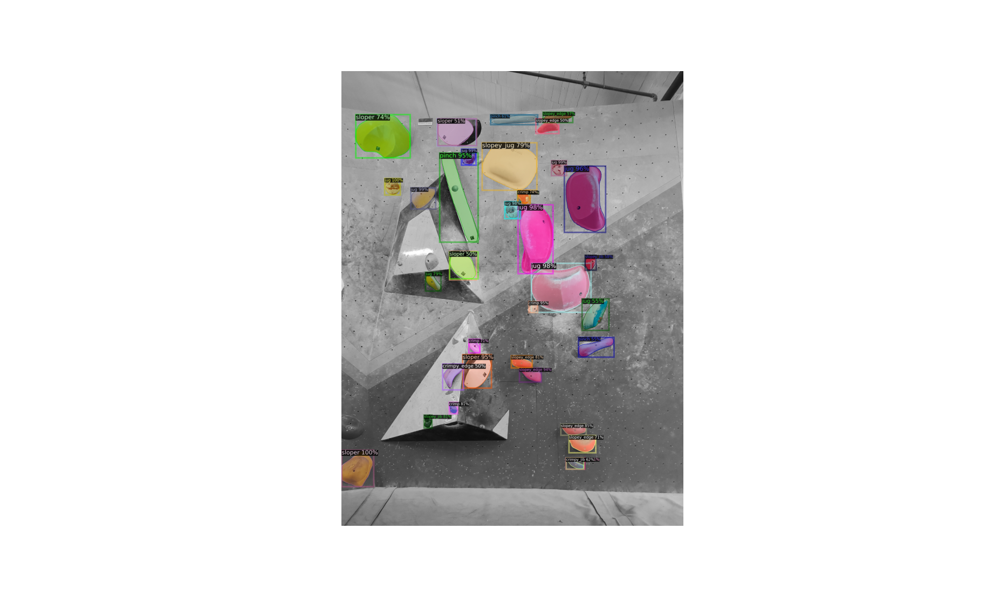

# 🧗 Climbing Route Detection

This is a small test project for setting up a Mask R-CNN model to recognise climbing 
holds from a picture and identify their type.

## 🏁 Goals

This project is the route detection part of a bigger project, with the goal of creating a tool for climbers to help analyze their movement.
Mainly, I aim to be able to efficently recognise and classify climbing holds. since this is important data that we can use to analyze climbs.

## 📌 Current State

As of right now, I can fine-tune a pre-trained Mask R-CNN model to recognise climbing holds, and then run it on an image.
I plan to make more training data to get more accurate results.

## ➡️ Project Structure

📂 dataset\
Contains the sample annotations (MS COCO format), along with images used for training and testing

📂 models\
A pre-trained model that you can try, without having to train a new one.

📂 results\
Some example result from a trained model

📂 src\
Directory containing the source files for training and running

📄 modifications.txt\
I had to make some modifications to some of the python packages, they are listed here.

## 📦 Dependencies

- Python 3.9
- Anaconda

- Python packages contained in:\
📋 requirements.txt

## 🚀 How to run

Here I'll show how to set up and run the project on your own machine.\
WARNING: Usually running and especially training a model locally is quite resource demanding so
you might want to check if you have the specs to do such tasks.

(This machine has an RTX 4060 amd 8gb VRAM for ex.)

### 1. PyCharm

- Install the PyCharm Community Edition IDE

You can download it from here: https://www.jetbrains.com/pycharm/download/

#### Create a New Project:
- Select a location
- Interpreter type: custom environment
- Environment: create new
- Type: Conda
- Python version: 3.9
- Name: Whatever you want to call it
- Path to conda: Path to your conda interpreter\
✅ Create

#### Setup and run:
In PyCharm open the terminal and run:
> git clone https://github.com/Csanicoder/climbing_route_detection

Select all files and directories inside the 'route_detection' directory and move them out into your own.

Then run:
> pip install -r requirements.txt

You can now run 'train.py' and 'inference.py' after to check out the results

## Some results

